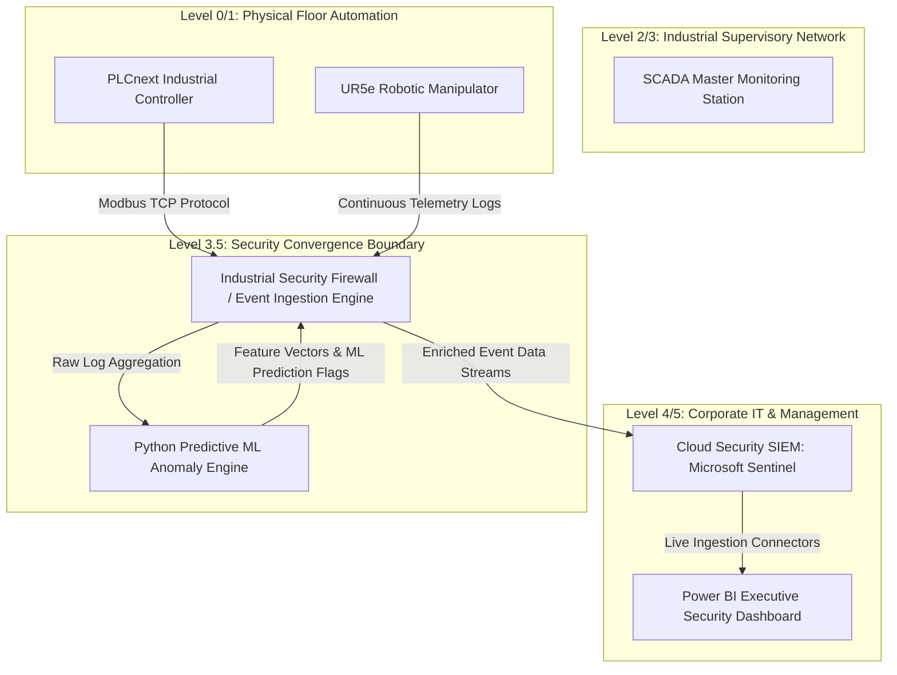

# Integrated IT/OT Cyber Security & Predictive Telemetry Lab

## Project Objective

This repository models an end-to-end Industrial Internet of Things (IIoT) and Operational Technology (OT) infrastructure pipeline. It bridges physical process telemetry with machine learning predictive anomaly detection, cloud-based SIEM threat hunting, and enterprise executive risk visualization.

The ultimate goal of this framework is to defend Level 1 industrial control assets against malicious trajectory or parameter modifications while maintaining strict operational visibility across the enterprise.

## Technical Stack & Ecosystem

* **Industrial/OT Controllers:** PLCnext Engineer logic simulation frameworks, Universal Robots (UR5e) multi-axis trajectory structures.
* **Predictive Analytics & ML:** Python (`scikit-learn`, `pandas`) running unsupervised `IsolationForest` algorithms to detect subtle operational drift and unauthorized firmware alterations.
* **Security Operations (SC-200 Domain):** Microsoft Sentinel SIEM tracking logic, Microsoft Defender for IoT configuration matrices, and custom Kusto Query Language (KQL) hunting queries.
* **Operational Visualization:** Power BI Desktop (Interactive asset health dashboards, telemetry profiling, threat matrix mapping).
* **Engineering Compliance Standards:** ISA/IEC 62443 network zoning policies, ACSC Essential 8 mitigation frameworks, and AS1100 technical drafting alignment.

---

## Network & Data Flow Architectur

### 📊 Phase 1: Industrial Baseline Telemetry Generation

- [X] Simulate structured status data streams from physical endpoints tracking joint velocities (rad/s), motor temperatures (°C), and continuous current draw (Amps).
- [X] Structure raw logging output layouts cleanly to model standard industrial data acquisition setups using Python data pipelines.

### 🤖 Phase 2: Predictive Machine Learning & Anomaly Injection

- [X] Train an unsupervised Python ML model on baseline telemetry parameters to lock in a normal "heartbeat" profile for the plant assets.
- [X] Inject deliberate cybersecurity vectors (such as a command-injection attack that alters motor velocity ceilings or rapid-fire network scans).
- [X] Leverage the predictive model to output deviation markers, flagging hidden attacks before traditional threshold alerts are triggered.

